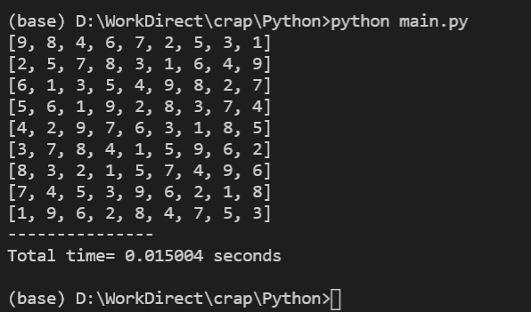

# Sudoku_py
Take notes of the sudoku solutions and also take a chance to practice python

## How to use 
For now only allow for the 9x9 sudoku.

Please copy your sudoku to input.csv file and split each digit by "," and leave the unassigned slot to 0.

```python
# how to run
python main.py
```

### e.g. input.csv
```sh
9,8,4,6,7,2,5,3,1
0,0,7,0,0,0,6,4,9
6,1,3,5,4,9,0,2,0
0,6,0,9,0,8,3,7,4
0,0,9,0,6,0,1,8,5
0,0,8,0,0,0,9,6,2
0,3,2,0,0,7,4,9,6
0,4,0,3,9,0,2,1,0
0,9,0,0,0,0,0,5,3
```
### Results



## Flow
- Load input.csv from file and turn it to 2D array 
- Init a Sudoku class
- Invoke solveSudoku function with 2D array
- Caculate the running time and results

## Sudoku class
### Rules:
- Check if there is no dupulacation from 1 to 9 in each row
- Check if there is no dupulacation from 1 to 9 in each col
- Check if there is no dupulacation from 1 to 9 in each 3x3 square
### Responsibility:
- Find the position of an unassigned slot
- Try to fill the slot with number from 1 to 9 to see if that matchs all the [rules](###Rules) listed previously. 
- Recursively run the second step until there is no unassigned slot position in return which also means the puzzle solved

## Reference
- https://www.youtube.com/watch?v=auK3PSZoidc
- https://leetcode.com/problems/sudoku-solver/discuss/15959/Accepted-Python-solution
- https://ithelp.ithome.com.tw/articles/10220639